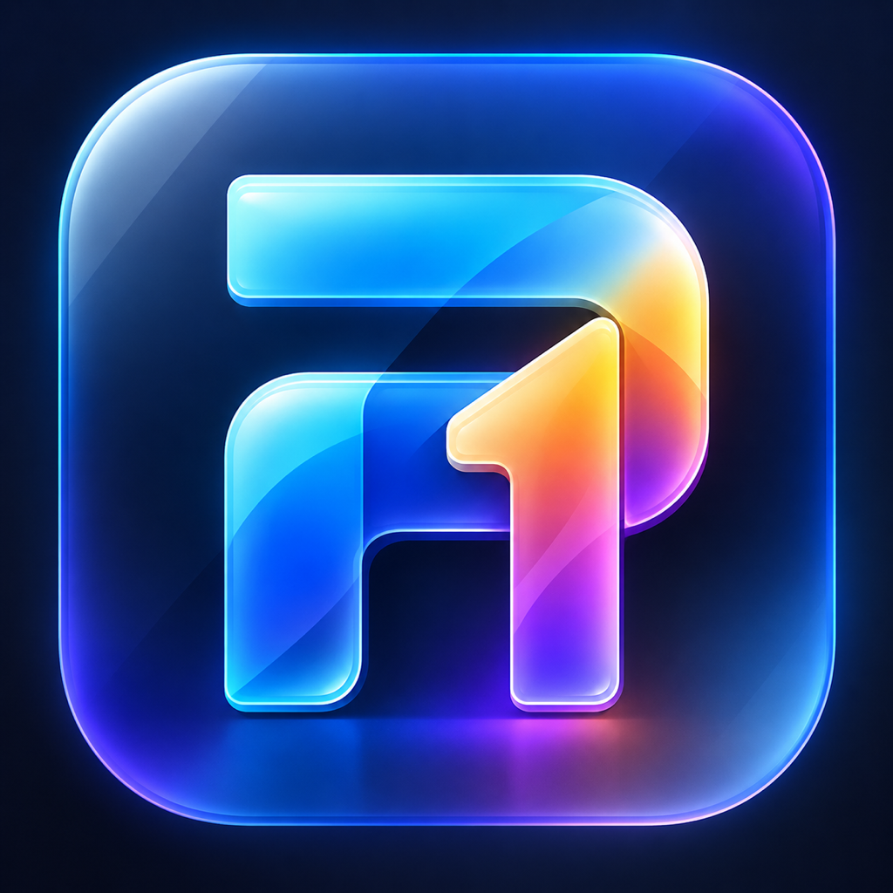

# 🌟 Prabu One — Personal Life Operating System

> **One unified, private, on-device iOS app for everything that matters:** vehicle maintenance, credit cards, recurring subscriptions, digital document vault, family milestones, and in-car display screen mirroring.



---

## 📖 Overview

**Prabu One** transforms your iPhone into your central personal operating command hub. Instead of fragmenting your life across single-purpose apps, Prabu One brings financial obligations, vehicle telemetry & health, document expirations, and life events under a single **attention-driven architecture**.

### 🔒 100% Private, Real & On-Device
- **Complete Editability Across Every Feature**: Every single metric, due target, date, balance, and record can be edited, updated, or deleted with instant feedback and disk persistence.
- **Zero Dummy Data**: Clean initial state without mock data or clutter, immediately ready for your real accounts, documents, and vehicle details.
- **Zero Third-Party Trackers**: No analytics SDKs, telemetry servers, or cloud dependencies.
- **Local Persistence**: All records are securely saved into your iPhone's protected application sandbox (`JSON` with atomic file writes).
- **Offline First**: Works without internet connectivity; alerts are scheduled natively with `UserNotifications`.
- **Zero Developer Fees**: Configured to build, sign, and install using a **Free Personal Apple ID** without requiring an Apple Developer Program membership.

---

## 🏛️ Core Life Pillars & Features

### 1. 🚗 Vehicle Hub (Kia Sonet & Daily Driver)
- **100% Editable Telemetry & Parameters**:
  - **Next Service Due Target (km)**: Tap the stat card or quick-edit to enter your exact target service interval (e.g. 50,000 km). Remaining km is automatically computed in real-time against your odometer.
  - **PUC Pollution Expiry Date**: Tap the PUC card to open the date picker and update certificate validity with automatic alert re-scheduling.
  - **Insurance Expiry Date**: Tap the Insurance card to update policy expiry dates.
  - **Live Odometer**: Tap "Update km" anytime to record new odometer readings.
  - **FASTag Balance**: Tap to adjust your active balance with low-balance thresholds.
  - **Full Profile Editor**: Tap the top pencil icon to edit Make & Model, Registration Number, Fuel Type, Odometer, Target Service, FASTag, Insurance, and PUC in one screen.
- **Service Records Management**: Add, view, edit (title, date, odometer, cost, service center, replaced parts), or delete maintenance entries.
- **Fuel Logs & Economy**: Add, view, edit (date, odometer, liters, cost), or delete refuel logs with dynamic fuel economy calculation (`km/L`).

### 2. 💳 Money & Cards Hub
- **Credit Card Visualizer & Editor**:
  - Tap pencil button or context menu to edit bank name, card name, last 4 digits, total credit limit, current outstanding, billing statement day, payment due day, and reward points.
  - Interactive utilization progress bar and available limit tracker.
  - **One-Tap "Mark as Paid"**: Instantly resets outstanding dues and synchronizes with home attention items.
- **Subscriptions Analytics & Management**:
  - Monthly recurring burn rate and annualized run-rate calculations.
  - Tap any subscription or use context menu to edit title, subtitle, category, due date, amount, renewal frequency (monthly/yearly), and notes.
- **Mobile & Utility Bills**:
  - Track SIM recharges, electricity, and utility commitments with tap-to-edit capabilities and countdown reminders.

### 3. 🗄️ Digital Document Vault
- **Official Records Vault**: Store vehicle RC Book, Driving License, Passport, Aadhaar, PAN, Insurance Policies, and PUC Certificates.
- **Full Edit Support**: Tap pencil button or context menu "Edit Document" to modify document name, type, registration number, or expiration date.
- **Live Validity Badges**:
  - 🟢 **VALID**
  - 🟠 **EXPIRING SOON** (< 30 days)
  - 🔴 **EXPIRED**
- **One-Tap Copy to Clipboard**: Tap any document number to copy it instantly with a tactile haptic HUD.

### 4. 🎂 Birthdays & Life Milestones
- **Countdown to Moments**: Track days remaining until family birthdays and wedding anniversaries.
- **Milestone Editor**: Tap pencil button or context menu to update name, celebration description, event date, and gift / dinner planning notes.
- **Smart Reminders**: Automated multi-stage alerts at 30 days, 7 days, 1 day, and on the day.

### 5. 📝 Quick Notes & Sudden Thoughts (Instant Scratchpad)
- **Sudden Thought Capture**: 1-tap action directly from the top header or the Quick Notes hub to note ideas, parking slot numbers, gate passes, locker codes, or temporary checklists instantly.
- **Immediate Keyboard Auto-Focus**: No mandatory fields or forms required — tap, type, and save with zero friction.
- **Pin Important Notes**: Keep vital codes or reminders pinned at the top.
- **Color Accent Tagging**: Visual organization with 5 curated color accents (Amber Yellow, Sky Blue, Emerald Green, Indigo Purple, Coral Rose).
- **Universal Search Integration**: All notes and memos are searchable directly from the home screen universal search bar.
- **One-Tap Copy & Share**: Copy note content to clipboard with tactile haptic feedback.

### 6. 🔴 Attention-Driven Dashboard
- **"Needs Attention" Radar**: Dynamically surfaces bills, service dues, policy renewals, or birthdays due today or within 7 days.
- **Tap-to-Edit Attention Items**: Tap any item in the attention card or search results to open the editor directly.
- **Monthly Outflow Predictor**: Computes total committed expenditure (₹) for the current calendar month.
- **Universal Instant Search**: Search across cards, subscriptions, utility bills, vehicle records, documents, birthdays, and quick notes.
- **Multi-Stage Local Reminders**: Proactive push notifications scheduled automatically at **30 days, 7 days, 3 days, 1 day, and 0 days** prior to due dates.

### 7. 🪞 Car Mirror Utility
- **Low-Latency Vehicle Mirroring**: Custom `AVSampleBufferDisplayLayer` hardware preview for streaming your iPhone screen to vehicle CarPlay displays.
- **Keep-Awake Protection**: Prevents display dimming or auto-lock (`isIdleTimerDisabled = true`) while mirroring is active.
- **Immersion Mode**: Tap on the live viewport to toggle distraction-free edge-to-edge mirroring.
- **Cross-Platform Compatibility**: Supports both physical hardware via `ScreenCaptureKit` and iOS Simulators via compile-time guards.

---

## 🛠️ Tech Stack & Architecture

- **Platform**: iOS 27.0+
- **Language**: Swift 6 / SwiftUI
- **Hardware Acceleration**: `ScreenCaptureKit`, `AVFoundation`
- **Feedback Engine**: Native `UIImpactFeedbackGenerator` & `UINotificationFeedbackGenerator`
- **Architecture**: MVVM + Observable State Store (`LifeStore.shared`) with automatic notification synchronizations (`ReminderEngine.shared`)

---

## 🚀 Building & Installing on Physical iPhone

1. Clone this repository:
   ```bash
   git clone https://github.com/Prabuganesan/prabuone.git
   cd prabuone
   ```

2. Open the project in **Xcode**:
   ```bash
   open PrabuOne.xcodeproj
   ```

3. Connect your iPhone via USB / Wi-Fi:
   - Select your iPhone in the top destination selector.
   - Go to `PrabuOne` target > **Signing & Capabilities**.
   - Ensure your **Personal Apple ID Team** is selected.

4. Press **`Cmd + R`** to compile, install, and run directly on your phone!

---

## 📄 License

Personal project developed by [Prabu Ganesan](https://github.com/Prabuganesan).
